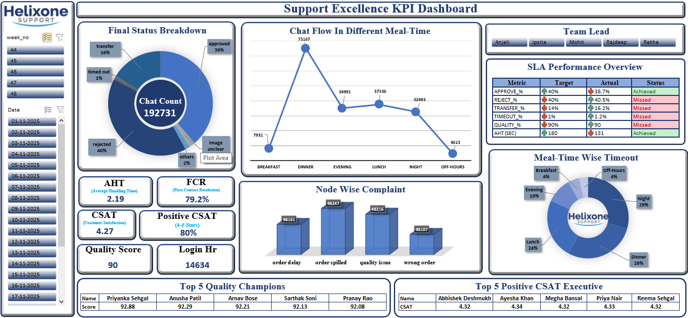

# 🧠 Support Excellence KPI Dashboard

📥 **Download Excel Dashboard (Interactive)**  
🔽 [Click here to download the full dashboard](./Helixone_KPI_Dashboard.xlsx) 🔽

This project analyzes customer support performance using Excel, Power Pivot data modeling, and KPI-based visualization.  
The dashboard transforms operational datasets into actionable insights for workforce planning, SLA monitoring, and service quality improvement.

---

## 📸 Dashboard Preview

---

## 📊 Dataset
**Dataset is fully anonymized.**

It includes:
- Agent performance
- SLA metrics
- Quality audits
- Login hours
- Customer satisfaction
- Complaint categories

Dataset is embedded in the Excel file to ensure dashboard functionality.

---

## 🛠️ Tools & Technologies
- **Microsoft Excel**
- **Power Pivot (Data Model)**
- **Pivot Tables & Pivot Charts**
- **Slicers & Interactivity**
- **Conditional Formatting**
- **Calculated Fields & Aggregations**

---

## 🎯 KPIs Included
- **AHT (Average Handling Time)**
- **FCR (First Contact Resolution)**
- **CSAT Score**
- **Positive CSAT (4–5 Stars)**
- **Quality Score**
- **Login Hours**
- **SLA Compliance %**

> KPIs are benchmarked against team SLA targets and classified as **Achieved / Missed**.

---

## 🔥 Dashboard Highlights
- **Meal-time chat volume insights**
- **Node-wise complaint segmentation**
- **SLA compliance visualization**
- **Top Quality Champions (Top 5 agents)**
- **Top Positive CSAT Executives**

The dashboard allows leaders to assess performance at both **macro level (team)** and **micro level (agent)**.

---

## 💡 Key Insights
- **Dinner time shows highest chat volume**
- **Reject% exceeds SLA threshold — improvement needed**
- **Timeout% remains within acceptable limits**
- **Multiple agents achieved > 92% Quality Score**
- **Order Spilled & Wrong Order drive high complaint volume**

> Insights are derived from real support workloads but anonymized for data privacy.

---

## 📈 Use Cases
- Support Team Performance Analysis
- SLA & Operational Monitoring
- Quality Assurance & Coaching
- Workforce Planning by Meal-Time
- Customer Satisfaction Reporting
- Agent Recognition & Incentive Design

---

## 🎯 Business Outcomes
- Identified **peak service periods** → optimize staffing
- Highlighted **SLA breaches** → targeted process improvements
- Compared **agent-level performance** → recognize high performers
- Segmented complaints by category → **reduce repeat issues**
- Improved insight into **service quality vs customer perception**

---

⭐ **This dashboard represents an end-to-end data analyst workflow:**
> Raw data → cleansing → modeling → KPI creation → visualization → insights → business strategy

---
